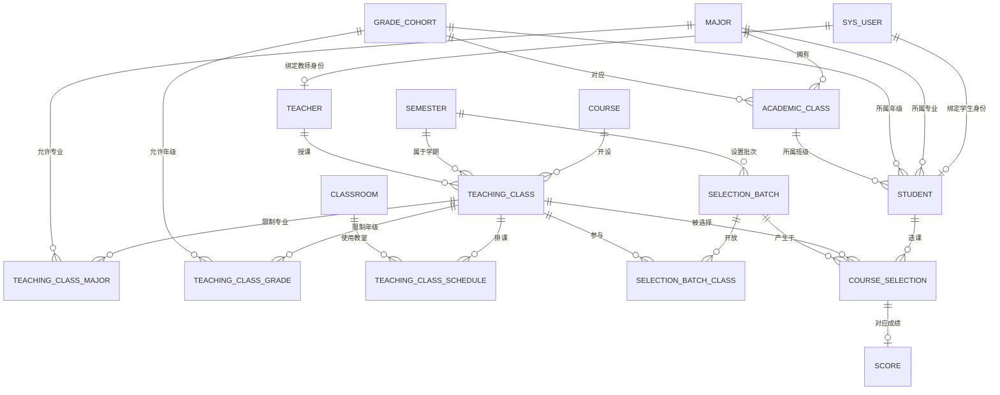

# 高校智慧教务选课平台 V1 ER 图与数据库模型设计

## 1. 文档说明

本文档基于《高校智慧教务选课平台 V1 业务流程设计》制定，用于将业务流程进一步落地为数据库实体、实体关系、表结构、约束和索引设计。

V1 数据库设计目标：

- 支撑学生、教师、教学管理员三类角色；
- 支撑课程与教学班分离；
- 支撑学生按专业、年级权限查询可选课程；
- 支撑教学班排课和时间冲突检测；
- 支撑选课批次控制；
- 支撑学生选课、退课、课表、学分；
- 支撑教师查看教学班和学生名单；
- 支撑成绩录入、发布和学生查询；
- 为 V1.1 候补功能和 V1.2 高并发选课预留扩展空间。

本文档以 **MySQL 8.x** 作为参考数据库。

---

# 2. 设计原则

## 2.1 课程和教学班必须分离

课程是学校长期存在的课程定义，例如：

```text
课程：
Java程序设计
课程编号：SE202
学分：3
课程性质：专业必修
```

教学班是某个学期中实际开设的一次授课实例，例如：

```text
2026-2027-1 学期
Java程序设计 01班
教师：张老师
教室：A101
周一 1-2 节
容量：60
```

因此：

```text
course
   ↓ 1:N
teaching_class
```

---

## 2.2 学生选课对象是教学班，不是课程

学生最终选择的是：

```text
某个学期
+
某门课程
+
某个教师
+
某个上课时间
+
某个教室
```

因此选课记录必须关联：

```text
student
+
teaching_class
```

而不能只保存 `course_id`。

---

## 2.3 选课权限以教学班为最终判断依据

同一门课程在不同学期、不同教学班中可能开放给不同专业和年级。

因此 V1 中：

- `course` 保存课程基础信息；
- `teaching_class` 表示具体开课；
- 教学班与专业、年级建立多对多关系；
- 学生课程查询和选课权限最终根据教学班适用专业、适用年级判断。

这样可以避免把课程长期定义和某学期开课范围混在一起。

---

## 2.4 课表不单独建业务主表

学生课表可以根据：

```text
学生有效选课记录
+
教学班排课信息
```

动态生成。

因此 V1 不建议建立独立的 `student_timetable` 表。

---

## 2.5 学分统计不单独保存累计结果

学生当前学期已选学分、已完成学分等数据，可以通过：

```text
course_selection
+
course
+
score
```

实时统计。

V1 不建议单独维护累计学分字段，避免数据不一致。

---

# 3. V1 核心实体

V1 建议包含以下核心实体：

| 编号 | 实体 | 表名 | 作用 |
|---|---|---|---|
| 1 | 系统用户 | `sys_user` | 登录账号和角色身份 |
| 2 | 学生 | `student` | 学生业务信息 |
| 3 | 教师 | `teacher` | 教师业务信息 |
| 4 | 专业 | `major` | 专业基础数据 |
| 5 | 年级 | `grade_cohort` | 年级/入学届别 |
| 6 | 行政班级 | `academic_class` | 学生所属行政班 |
| 7 | 教室 | `classroom` | 教室信息 |
| 8 | 学期 | `semester` | 学年、学期 |
| 9 | 课程 | `course` | 课程基础定义 |
| 10 | 教学班 | `teaching_class` | 某学期实际开设课程 |
| 11 | 教学班适用专业 | `teaching_class_major` | 控制专业选课权限 |
| 12 | 教学班适用年级 | `teaching_class_grade` | 控制年级选课权限 |
| 13 | 教学班排课 | `teaching_class_schedule` | 上课时间、教室、周次 |
| 14 | 选课批次 | `selection_batch` | 控制选课和退课时间 |
| 15 | 批次教学班 | `selection_batch_class` | 控制批次开放哪些教学班 |
| 16 | 选课记录 | `course_selection` | 学生选课和退课业务记录 |
| 17 | 成绩 | `score` | 教师录入和发布成绩 |

---

# 4. V1 ER 图



---

# 5. 系统用户表 `sys_user`

用于统一管理登录账号。

## 5.1 表结构

| 字段 | 类型 | 约束 | 说明 |
|---|---|---|---|
| `id` | BIGINT | PK | 用户 ID |
| `username` | VARCHAR(50) | UNIQUE, NOT NULL | 登录账号 |
| `password_hash` | VARCHAR(255) | NOT NULL | 加密后的密码 |
| `role` | VARCHAR(20) | NOT NULL | 用户角色 |
| `status` | TINYINT | NOT NULL | 账号状态 |
| `last_login_at` | DATETIME | NULL | 最后登录时间 |
| `created_at` | DATETIME | NOT NULL | 创建时间 |
| `updated_at` | DATETIME | NOT NULL | 更新时间 |

## 5.2 角色取值

```text
STUDENT
TEACHER
ADMIN
```

## 5.3 状态取值

```text
1 = 启用
0 = 禁用
```

## 5.4 约束

```text
username 唯一
```

密码不得明文保存。

---

# 6. 专业表 `major`

## 6.1 表结构

| 字段 | 类型 | 约束 | 说明 |
|---|---|---|---|
| `id` | BIGINT | PK | 专业 ID |
| `major_code` | VARCHAR(30) | UNIQUE, NOT NULL | 专业编号 |
| `major_name` | VARCHAR(100) | NOT NULL | 专业名称 |
| `status` | TINYINT | NOT NULL | 是否启用 |
| `created_at` | DATETIME | NOT NULL | 创建时间 |
| `updated_at` | DATETIME | NOT NULL | 更新时间 |

示例：

```text
SE      软件工程
CS      计算机科学与技术
AI      人工智能
```

---

# 7. 年级表 `grade_cohort`

这里的年级表示学生所属届别，例如：

```text
2024级
2025级
2026级
```

## 7.1 表结构

| 字段 | 类型 | 约束 | 说明 |
|---|---|---|---|
| `id` | BIGINT | PK | 年级 ID |
| `grade_name` | VARCHAR(30) | UNIQUE, NOT NULL | 年级名称 |
| `entry_year` | INT | UNIQUE, NOT NULL | 入学年份 |
| `status` | TINYINT | NOT NULL | 是否启用 |
| `created_at` | DATETIME | NOT NULL | 创建时间 |
| `updated_at` | DATETIME | NOT NULL | 更新时间 |

---

# 8. 行政班级表 `academic_class`

用于表示：

```text
软件工程 2025级 1班
```

## 8.1 表结构

| 字段 | 类型 | 约束 | 说明 |
|---|---|---|---|
| `id` | BIGINT | PK | 班级 ID |
| `class_code` | VARCHAR(30) | UNIQUE, NOT NULL | 班级编号 |
| `class_name` | VARCHAR(100) | NOT NULL | 班级名称 |
| `major_id` | BIGINT | FK, NOT NULL | 所属专业 |
| `grade_id` | BIGINT | FK, NOT NULL | 所属年级 |
| `status` | TINYINT | NOT NULL | 是否启用 |
| `created_at` | DATETIME | NOT NULL | 创建时间 |
| `updated_at` | DATETIME | NOT NULL | 更新时间 |

## 8.2 外键关系

```text
academic_class.major_id → major.id
academic_class.grade_id → grade_cohort.id
```

---

# 9. 学生表 `student`

## 9.1 表结构

| 字段 | 类型 | 约束 | 说明 |
|---|---|---|---|
| `id` | BIGINT | PK | 学生 ID |
| `user_id` | BIGINT | UNIQUE, FK, NOT NULL | 对应登录账号 |
| `student_no` | VARCHAR(30) | UNIQUE, NOT NULL | 学号 |
| `student_name` | VARCHAR(50) | NOT NULL | 学生姓名 |
| `major_id` | BIGINT | FK, NOT NULL | 所属专业 |
| `grade_id` | BIGINT | FK, NOT NULL | 所属年级 |
| `class_id` | BIGINT | FK, NOT NULL | 所属行政班 |
| `status` | TINYINT | NOT NULL | 学籍/业务状态 |
| `created_at` | DATETIME | NOT NULL | 创建时间 |
| `updated_at` | DATETIME | NOT NULL | 更新时间 |

## 9.2 外键

```text
student.user_id → sys_user.id
student.major_id → major.id
student.grade_id → grade_cohort.id
student.class_id → academic_class.id
```

## 9.3 业务约束

创建或修改学生时必须校验：

```text
学生 major_id
=
班级 major_id
```

并且：

```text
学生 grade_id
=
班级 grade_id
```

避免出现：

```text
学生：软件工程 2025级
班级：计算机科学 2024级1班
```

这种错误数据。

---

# 10. 教师表 `teacher`

## 10.1 表结构

| 字段 | 类型 | 约束 | 说明 |
|---|---|---|---|
| `id` | BIGINT | PK | 教师 ID |
| `user_id` | BIGINT | UNIQUE, FK, NOT NULL | 对应登录账号 |
| `teacher_no` | VARCHAR(30) | UNIQUE, NOT NULL | 教师编号 |
| `teacher_name` | VARCHAR(50) | NOT NULL | 教师姓名 |
| `title` | VARCHAR(50) | NULL | 职称 |
| `status` | TINYINT | NOT NULL | 是否在职/启用 |
| `created_at` | DATETIME | NOT NULL | 创建时间 |
| `updated_at` | DATETIME | NOT NULL | 更新时间 |

外键：

```text
teacher.user_id → sys_user.id
```

---

# 11. 教室表 `classroom`

## 11.1 表结构

| 字段 | 类型 | 约束 | 说明 |
|---|---|---|---|
| `id` | BIGINT | PK | 教室 ID |
| `building_name` | VARCHAR(100) | NOT NULL | 教学楼 |
| `room_no` | VARCHAR(30) | NOT NULL | 教室编号 |
| `capacity` | INT | NOT NULL | 教室容量 |
| `status` | TINYINT | NOT NULL | 是否可用 |
| `created_at` | DATETIME | NOT NULL | 创建时间 |
| `updated_at` | DATETIME | NOT NULL | 更新时间 |

## 11.2 唯一约束

推荐：

```text
UNIQUE(building_name, room_no)
```

避免同一教学楼出现重复教室编号。

---

# 12. 学期表 `semester`

用于统一管理学期。

例如：

```text
2026-2027 学年 第一学期
```

## 12.1 表结构

| 字段 | 类型 | 约束 | 说明 |
|---|---|---|---|
| `id` | BIGINT | PK | 学期 ID |
| `semester_code` | VARCHAR(30) | UNIQUE, NOT NULL | 学期编号 |
| `academic_year` | VARCHAR(20) | NOT NULL | 学年 |
| `term_no` | TINYINT | NOT NULL | 第几学期 |
| `start_date` | DATE | NOT NULL | 学期开始日期 |
| `end_date` | DATE | NOT NULL | 学期结束日期 |
| `status` | VARCHAR(20) | NOT NULL | 学期状态 |
| `created_at` | DATETIME | NOT NULL | 创建时间 |
| `updated_at` | DATETIME | NOT NULL | 更新时间 |

状态可以为：

```text
PLANNED
ACTIVE
FINISHED
```

---

# 13. 课程表 `course`

课程只保存长期基础定义。

## 13.1 表结构

| 字段 | 类型 | 约束 | 说明 |
|---|---|---|---|
| `id` | BIGINT | PK | 课程 ID |
| `course_code` | VARCHAR(30) | UNIQUE, NOT NULL | 课程编号 |
| `course_name` | VARCHAR(100) | NOT NULL | 课程名称 |
| `description` | TEXT | NULL | 课程简介 |
| `credit` | DECIMAL(4,1) | NOT NULL | 学分 |
| `course_type` | VARCHAR(30) | NOT NULL | 课程性质 |
| `default_capacity` | INT | NULL | 默认教学班容量 |
| `status` | TINYINT | NOT NULL | 是否启用 |
| `created_at` | DATETIME | NOT NULL | 创建时间 |
| `updated_at` | DATETIME | NOT NULL | 更新时间 |

## 13.2 课程性质

可以使用：

```text
REQUIRED
MAJOR_ELECTIVE
PUBLIC_ELECTIVE
```

对应：

```text
必修
专业选修
公共选修
```

---

# 14. 教学班表 `teaching_class`

这是整个选课系统的核心实体之一。

## 14.1 表结构

| 字段 | 类型 | 约束 | 说明 |
|---|---|---|---|
| `id` | BIGINT | PK | 教学班 ID |
| `class_code` | VARCHAR(50) | UNIQUE, NOT NULL | 教学班编号 |
| `class_name` | VARCHAR(150) | NOT NULL | 教学班名称 |
| `course_id` | BIGINT | FK, NOT NULL | 对应课程 |
| `semester_id` | BIGINT | FK, NOT NULL | 所属学期 |
| `teacher_id` | BIGINT | FK, NOT NULL | 任课教师 |
| `capacity` | INT | NOT NULL | 最大选课人数 |
| `max_credit_limit` | DECIMAL(4,1) | NULL | 可选，特殊限制时使用 |
| `status` | VARCHAR(20) | NOT NULL | 教学班状态 |
| `created_at` | DATETIME | NOT NULL | 创建时间 |
| `updated_at` | DATETIME | NOT NULL | 更新时间 |

## 14.2 外键

```text
teaching_class.course_id → course.id
teaching_class.semester_id → semester.id
teaching_class.teacher_id → teacher.id
```

## 14.3 状态建议

```text
DRAFT
AVAILABLE
CLOSED
CANCELLED
```

说明：

- `DRAFT`：排课尚未完成；
- `AVAILABLE`：允许被选课批次开放；
- `CLOSED`：停止选课；
- `CANCELLED`：教学班取消。

---

# 15. 教学班适用专业表 `teaching_class_major`

用于控制：

> 哪些专业的学生可以看到并选择该教学班。

这是学生选课权限的核心表之一。

## 15.1 表结构

| 字段 | 类型 | 约束 | 说明 |
|---|---|---|---|
| `id` | BIGINT | PK | 主键 |
| `teaching_class_id` | BIGINT | FK, NOT NULL | 教学班 ID |
| `major_id` | BIGINT | FK, NOT NULL | 专业 ID |

## 15.2 唯一约束

```text
UNIQUE(teaching_class_id, major_id)
```

避免重复配置同一专业。

---

# 16. 教学班适用年级表 `teaching_class_grade`

用于控制：

> 哪些年级可以看到并选择该教学班。

## 16.1 表结构

| 字段 | 类型 | 约束 | 说明 |
|---|---|---|---|
| `id` | BIGINT | PK | 主键 |
| `teaching_class_id` | BIGINT | FK, NOT NULL | 教学班 ID |
| `grade_id` | BIGINT | FK, NOT NULL | 年级 ID |

## 16.2 唯一约束

```text
UNIQUE(teaching_class_id, grade_id)
```

---

# 17. 学生可选课程权限查询逻辑

学生登录后系统获得：

```text
student.major_id
student.grade_id
```

查询教学班时需要同时满足：

```text
教学班属于当前学期
AND
教学班状态 = AVAILABLE
AND
教学班参与当前有效选课批次
AND
teaching_class_major.major_id = 当前学生专业
AND
teaching_class_grade.grade_id = 当前学生年级
```

逻辑上可以理解为：

```text
学生专业
   ↓
匹配教学班适用专业
   +
学生年级
   ↓
匹配教学班适用年级
   +
当前选课批次
   ↓
最终返回可选教学班
```

因此：

> 学生前端不会获取无权限课程的数据。

同时，选课接口必须再次执行专业和年级权限校验，不能只依赖查询列表。

---

# 18. 教学班排课表 `teaching_class_schedule`

一个教学班可能一周存在多次上课，因此不能把上课时间简单放在 `teaching_class` 中。

例如：

```text
Java程序设计

周一 1-2 节 A101
周三 3-4 节 A203
```

应该对应两条排课记录。

## 18.1 表结构

| 字段 | 类型 | 约束 | 说明 |
|---|---|---|---|
| `id` | BIGINT | PK | 排课 ID |
| `teaching_class_id` | BIGINT | FK, NOT NULL | 教学班 ID |
| `classroom_id` | BIGINT | FK, NOT NULL | 教室 ID |
| `weekday` | TINYINT | NOT NULL | 星期几 |
| `start_section` | TINYINT | NOT NULL | 开始节次 |
| `end_section` | TINYINT | NOT NULL | 结束节次 |
| `start_week` | TINYINT | NOT NULL | 开始周 |
| `end_week` | TINYINT | NOT NULL | 结束周 |
| `created_at` | DATETIME | NOT NULL | 创建时间 |
| `updated_at` | DATETIME | NOT NULL | 更新时间 |

## 18.2 星期建议

```text
1 = 周一
2 = 周二
3 = 周三
4 = 周四
5 = 周五
6 = 周六
7 = 周日
```

---

# 19. 排课冲突判断

## 19.1 时间重叠判断

两个排课记录冲突，需要同时满足：

```text
星期相同
AND
教学周存在交集
AND
节次存在交集
```

节次交集判断：

```text
新开始节次 <= 已有结束节次
AND
新结束节次 >= 已有开始节次
```

教学周交集判断：

```text
新开始周 <= 已有结束周
AND
新结束周 >= 已有开始周
```

---

## 19.2 教师冲突

创建排课时查询：

```text
同一 semester
+
同一 teacher
+
时间重叠
```

如果存在记录，则禁止保存。

---

## 19.3 教室冲突

查询：

```text
同一 semester
+
同一 classroom
+
时间重叠
```

如果存在，则禁止保存。

---

# 20. 选课批次表 `selection_batch`

## 20.1 表结构

| 字段 | 类型 | 约束 | 说明 |
|---|---|---|---|
| `id` | BIGINT | PK | 批次 ID |
| `batch_name` | VARCHAR(100) | NOT NULL | 批次名称 |
| `semester_id` | BIGINT | FK, NOT NULL | 所属学期 |
| `start_time` | DATETIME | NOT NULL | 选课开始时间 |
| `end_time` | DATETIME | NOT NULL | 选课结束时间 |
| `drop_deadline` | DATETIME | NULL | 退课截止时间 |
| `status` | VARCHAR(20) | NOT NULL | 批次状态 |
| `created_at` | DATETIME | NOT NULL | 创建时间 |
| `updated_at` | DATETIME | NOT NULL | 更新时间 |

## 20.2 状态

```text
NOT_STARTED
IN_PROGRESS
ENDED
```

---

# 21. 批次教学班关联表 `selection_batch_class`

用于表示：

> 某个选课批次开放哪些教学班。

## 21.1 表结构

| 字段 | 类型 | 约束 | 说明 |
|---|---|---|---|
| `id` | BIGINT | PK | 主键 |
| `batch_id` | BIGINT | FK, NOT NULL | 选课批次 |
| `teaching_class_id` | BIGINT | FK, NOT NULL | 教学班 |

## 21.2 唯一约束

```text
UNIQUE(batch_id, teaching_class_id)
```

---

# 22. 选课记录表 `course_selection`

这是整个选课业务最重要的事务表。

## 22.1 表结构

| 字段 | 类型 | 约束 | 说明 |
|---|---|---|---|
| `id` | BIGINT | PK | 选课记录 ID |
| `student_id` | BIGINT | FK, NOT NULL | 学生 ID |
| `teaching_class_id` | BIGINT | FK, NOT NULL | 教学班 ID |
| `batch_id` | BIGINT | FK, NOT NULL | 选课批次 |
| `status` | VARCHAR(20) | NOT NULL | 选课状态 |
| `selected_at` | DATETIME | NOT NULL | 选课时间 |
| `withdrawn_at` | DATETIME | NULL | 退课时间 |
| `created_at` | DATETIME | NOT NULL | 创建时间 |
| `updated_at` | DATETIME | NOT NULL | 更新时间 |

## 22.2 状态

V1：

```text
SELECTED
WITHDRAWN
```

V1.1 可以扩展：

```text
WAITING
```

---

# 23. 选课唯一约束

推荐：

```text
UNIQUE(student_id, teaching_class_id)
```

这样同一个学生对同一个教学班只保留一条业务记录。

退课后：

```text
status = WITHDRAWN
```

如果后续允许学生重新选择同一个教学班，可以直接把原记录重新更新为：

```text
SELECTED
```

并更新 `selected_at`。

这样不会产生大量重复历史记录。

---

# 24. 选课核心校验涉及的数据表

学生选课时：

## 24.1 批次校验

查询：

```text
selection_batch
selection_batch_class
```

---

## 24.2 专业权限校验

查询：

```text
student
teaching_class_major
```

判断：

```text
student.major_id
是否存在于
teaching_class_major
```

---

## 24.3 年级权限校验

查询：

```text
student
teaching_class_grade
```

---

## 24.4 重复选课校验

查询：

```text
course_selection
```

---

## 24.5 时间冲突校验

查询：

```text
course_selection
teaching_class_schedule
```

找到学生当前已选的所有教学班排课，与目标教学班排课比较。

---

## 24.6 学分上限校验

查询：

```text
course_selection
teaching_class
course
```

统计：

```text
SUM(course.credit)
```

---

## 24.7 课程容量校验

统计：

```text
course_selection
WHERE teaching_class_id = ?
AND status = 'SELECTED'
```

得到当前有效选课人数。

V1 可以直接基于数据库统计。

V1.2 再升级为 Redis + Lua 的高并发名额控制。

---

# 25. 是否需要在教学班中保存 `selected_count`

V1 建议：

> 不直接保存 `selected_count`。

原因：

如果同时维护：

```text
teaching_class.selected_count
```

和：

```text
course_selection
```

就会出现两份数据源。

例如：

```text
选课记录有 58 人
selected_count 却是 57
```

会造成数据不一致。

因此 V1 查询当前人数时建议：

```sql
COUNT(course_selection.id)
```

并限制：

```text
status = SELECTED
```

V1.2 高并发版本再使用 Redis 维护实时剩余名额。

---

# 26. 学生课表查询模型

不需要：

```text
student_timetable
```

表。

课表查询：

```text
student
   ↓
course_selection
   ↓
teaching_class
   ↓
teaching_class_schedule
   ↓
course
teacher
classroom
```

查询条件：

```text
student_id = 当前学生
AND
course_selection.status = SELECTED
AND
teaching_class.semester_id = 当前学期
```

---

# 27. 学生学分统计模型

## 27.1 当前学期已选学分

查询：

```text
course_selection
→ teaching_class
→ course
```

统计：

```text
SUM(course.credit)
```

条件：

```text
course_selection.status = SELECTED
AND
teaching_class.semester_id = 当前学期
```

---

## 27.2 按课程性质统计

可以通过：

```text
course.course_type
```

分组统计：

```text
REQUIRED
MAJOR_ELECTIVE
PUBLIC_ELECTIVE
```

---

# 28. 成绩表 `score`

成绩应该关联选课记录，而不是直接关联学生和课程。

这样可以明确：

> 某个学生在某个具体教学班中的成绩。

## 28.1 表结构

| 字段 | 类型 | 约束 | 说明 |
|---|---|---|---|
| `id` | BIGINT | PK | 成绩 ID |
| `course_selection_id` | BIGINT | UNIQUE, FK, NOT NULL | 对应选课记录 |
| `score_value` | DECIMAL(5,2) | NOT NULL | 分数 |
| `status` | VARCHAR(20) | NOT NULL | 发布状态 |
| `published_at` | DATETIME | NULL | 发布时间 |
| `created_at` | DATETIME | NOT NULL | 创建时间 |
| `updated_at` | DATETIME | NOT NULL | 更新时间 |

## 28.2 状态

```text
UNPUBLISHED
PUBLISHED
```

---

# 29. 成绩业务约束

## 29.1 成绩范围

百分制情况下：

```text
0 <= score_value <= 100
```

建议同时在业务层校验。

---

## 29.2 一个选课记录只能有一个成绩

约束：

```text
UNIQUE(course_selection_id)
```

---

## 29.3 只有有效选课学生才能录入成绩

录入成绩时需要校验：

```text
course_selection.status = SELECTED
```

---

## 29.4 教师权限校验

教师录入成绩时：

```text
当前教师 ID
=
teaching_class.teacher_id
```

否则拒绝操作。

---

## 29.5 学生查询成绩

学生只能查询：

```text
自己的 course_selection
+
score.status = PUBLISHED
```

未发布成绩不能返回给学生。

---

# 30. V1 数据库关系详细说明

## 30.1 用户与学生

```text
sys_user 1 —— 0..1 student
```

一个学生账号对应一个学生业务实体。

---

## 30.2 用户与教师

```text
sys_user 1 —— 0..1 teacher
```

---

## 30.3 专业与学生

```text
major 1 —— N student
```

---

## 30.4 年级与学生

```text
grade_cohort 1 —— N student
```

---

## 30.5 行政班与学生

```text
academic_class 1 —— N student
```

---

## 30.6 课程与教学班

```text
course 1 —— N teaching_class
```

---

## 30.7 教师与教学班

V1 一个教学班只设置一个主讲教师：

```text
teacher 1 —— N teaching_class
```

如果后续需要多人联合授课，可以扩展：

```text
teaching_class_teacher
```

中间表。

---

## 30.8 教学班与专业

```text
teaching_class N —— N major
```

通过：

```text
teaching_class_major
```

实现。

---

## 30.9 教学班与年级

```text
teaching_class N —— N grade_cohort
```

通过：

```text
teaching_class_grade
```

实现。

---

## 30.10 教学班与排课

```text
teaching_class 1 —— N teaching_class_schedule
```

---

## 30.11 学生与教学班

```text
student N —— N teaching_class
```

通过：

```text
course_selection
```

实现。

---

## 30.12 选课记录与成绩

```text
course_selection 1 —— 0..1 score
```

学生选课以后不一定已经产生成绩，因此是一对零或一。

---

# 31. 推荐索引设计

除了主键和唯一索引外，V1 建议增加以下普通索引。

## 31.1 `student`

```text
INDEX idx_student_major(major_id)
INDEX idx_student_grade(grade_id)
INDEX idx_student_class(class_id)
```

---

## 31.2 `teaching_class`

```text
INDEX idx_tc_course(course_id)
INDEX idx_tc_semester(semester_id)
INDEX idx_tc_teacher(teacher_id)
INDEX idx_tc_status(status)
```

---

## 31.3 `teaching_class_major`

```text
INDEX idx_tcm_major(major_id)
```

---

## 31.4 `teaching_class_grade`

```text
INDEX idx_tcg_grade(grade_id)
```

---

## 31.5 `teaching_class_schedule`

```text
INDEX idx_schedule_class(teaching_class_id)
INDEX idx_schedule_room(classroom_id)
INDEX idx_schedule_weekday(weekday)
```

---

## 31.6 `selection_batch`

```text
INDEX idx_batch_semester(semester_id)
INDEX idx_batch_status(status)
```

---

## 31.7 `course_selection`

这是访问频率最高的核心表之一。

建议：

```text
UNIQUE uk_student_teaching_class(student_id, teaching_class_id)

INDEX idx_selection_student_status(student_id, status)

INDEX idx_selection_class_status(teaching_class_id, status)

INDEX idx_selection_batch(batch_id)
```

这些索引可以分别优化：

- 我的课程；
- 学生课表；
- 学分统计；
- 教学班学生名单；
- 当前选课人数。

---

## 31.8 `score`

```text
UNIQUE uk_score_selection(course_selection_id)

INDEX idx_score_status(status)
```

---

# 32. 外键策略建议

从业务设计角度存在明确外键关系。

例如：

```text
student.major_id → major.id
```

是否真正使用数据库物理外键，可以根据项目习惯决定。

个人项目 V1 推荐：

> 可以保留数据库外键，帮助保证数据完整性。

如果后续数据量和并发量明显增加，也可以改为：

```text
应用层保证关系
+
数据库索引
```

---

# 33. 删除策略

不建议直接物理删除已经参与业务的数据。

例如：

```text
课程已经被教学班引用
教师已经有教学班
学生已经存在选课记录
```

此时直接 `DELETE` 容易破坏历史数据。

推荐：

## 基础数据

例如：

```text
major
teacher
student
course
classroom
```

使用：

```text
status
```

控制启用 / 禁用。

---

## 事务数据

例如：

```text
course_selection
score
```

不做物理删除。

选课退课通过：

```text
SELECTED
→
WITHDRAWN
```

保留业务历史。

---

# 34. V1 推荐表清单

最终 V1 建议先创建以下 17 张表：

```text
01. sys_user

02. major

03. grade_cohort

04. academic_class

05. student

06. teacher

07. classroom

08. semester

09. course

10. teaching_class

11. teaching_class_major

12. teaching_class_grade

13. teaching_class_schedule

14. selection_batch

15. selection_batch_class

16. course_selection

17. score
```

---

# 35. 数据库模块划分

可以按照后端模块理解这些表：

## 用户与权限模块

```text
sys_user
student
teacher
```

---

## 基础教务模块

```text
major
grade_cohort
academic_class
classroom
semester
```

---

## 课程与排课模块

```text
course
teaching_class
teaching_class_major
teaching_class_grade
teaching_class_schedule
```

---

## 选课模块

```text
selection_batch
selection_batch_class
course_selection
```

---

## 成绩模块

```text
score
```

---

# 36. 核心查询关系

## 36.1 学生查询可选课程

```text
student
   ↓
major / grade
   ↓
teaching_class_major
teaching_class_grade
   ↓
teaching_class
   ↓
selection_batch_class
   ↓
selection_batch
   ↓
course
teacher
schedule
classroom
```

---

## 36.2 学生选课

主要访问：

```text
student
selection_batch
selection_batch_class
teaching_class
teaching_class_major
teaching_class_grade
teaching_class_schedule
course_selection
course
```

---

## 36.3 教师查询学生名单

```text
teacher
   ↓
teaching_class
   ↓
course_selection
   ↓
student
```

---

## 36.4 教师录入成绩

```text
teacher
   ↓
teaching_class
   ↓
course_selection
   ↓
score
```

---

# 37. V1 数据模型对业务流程的支撑

## 教务创建课程

```text
course
```

---

## 教务创建教学班

```text
teaching_class
```

---

## 配置选课范围

```text
teaching_class_major
teaching_class_grade
```

---

## 教务排课

```text
teaching_class_schedule
classroom
```

---

## 教务开启选课批次

```text
selection_batch
selection_batch_class
```

---

## 学生查询可选课程

```text
student
+
teaching_class_major
+
teaching_class_grade
+
selection_batch_class
```

---

## 学生选课

```text
course_selection
```

---

## 学生查看课表

```text
course_selection
+
teaching_class_schedule
```

---

## 教师查看学生名单

```text
course_selection
+
student
```

---

## 教师录入成绩

```text
score
```

---

# 38. V1.1 扩展预留

后续候补功能可以新增：

```text
course_waitlist
```

例如：

| 字段 | 说明 |
|---|---|
| `id` | 主键 |
| `student_id` | 学生 |
| `teaching_class_id` | 教学班 |
| `batch_id` | 选课批次 |
| `queue_no` | 候补顺序 |
| `status` | 候补状态 |
| `created_at` | 加入候补时间 |

这样不需要破坏 V1 当前选课表结构。

---

# 39. V1.2 高并发扩展预留

V1.2 可以在当前模型基础上增加：

```text
Redis 剩余名额缓存
+
Lua 原子扣减
+
数据库事务
+
course_selection 唯一索引
+
消息队列
```

其中：

```text
UNIQUE(student_id, teaching_class_id)
```

已经为防止重复选课提供数据库层兜底。

数据库中的 `capacity` 继续作为教学班容量最终配置来源。

---

# 40. 当前设计中的关键决策

## 决策 1：课程权限放在教学班

原因：

同一门课程不同教学班可以开放给不同专业、年级。

---

## 决策 2：排课单独建表

原因：

一个教学班可能一周上多次课。

---

## 决策 3：课表不单独建表

原因：

课表可以由选课记录和排课信息实时生成。

---

## 决策 4：学分累计值不单独存储

原因：

避免与实际选课、成绩数据产生不一致。

---

## 决策 5：成绩关联选课记录

原因：

可以准确表达：

```text
某学生
在某个具体教学班
获得某个成绩
```

---

## 决策 6：V1 不保存教学班实时已选人数

原因：

V1 数据量下可以从有效选课记录实时统计，避免双写数据一致性问题。

V1.2 再通过 Redis 解决高并发名额问题。

---

# 41. 下一步建议

完成 ER 图和数据库模型后，下一阶段建议进入：

```text
ER 图
   ↓
数据库模型
   ↓
数据库字段最终确认
   ↓
建表 SQL
   ↓
后端领域模型 / Entity
   ↓
接口设计
```

因此下一份设计文档建议是：

> 《高校智慧教务选课平台 V1 数据库建表 SQL 与接口设计》

其中可以继续完成：

- MySQL 建表 SQL；
- 字段默认值；
- 唯一索引；
- 普通索引；
- REST API 路径；
- 请求参数；
- 返回结构；
- 不同角色接口权限。
